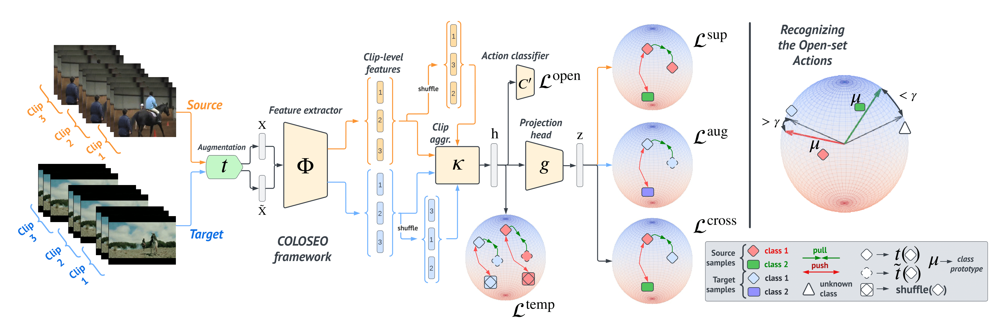

# COLOSEO

This repository contains the official implementation of our COLOSEO framework, referring to our paper "Simplifying Open-Set Video Domain Adaptation with Contrastive Learning".

A CONDA environment to properly run the code is provided in the `conda_env.yml` file. The `scripts` folder contains a single `run.sh` bash scripts containing command examples for the hmdb-ucf/ucf-olympic and Epic-Kitchens settings, respectively.

___

For any comment, need or request feel free to [contact us](mailto:giacomo.zara@unitn.it) at any time.